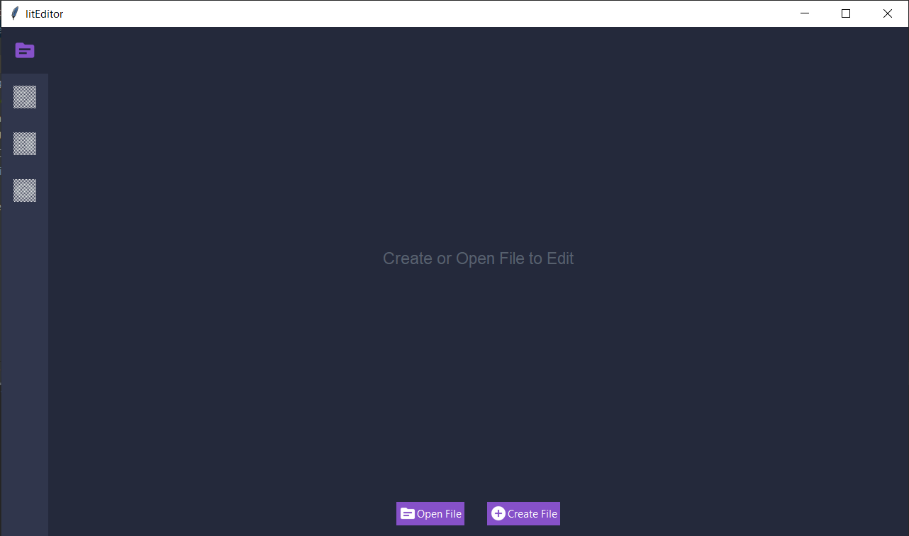
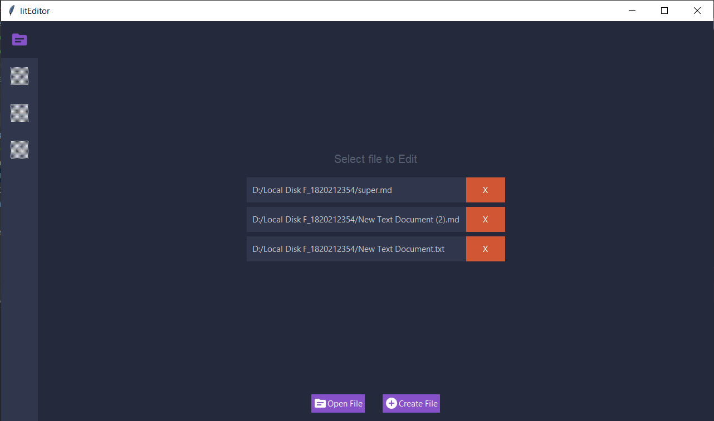
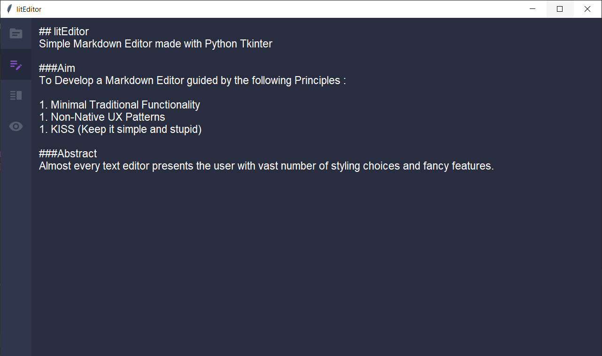
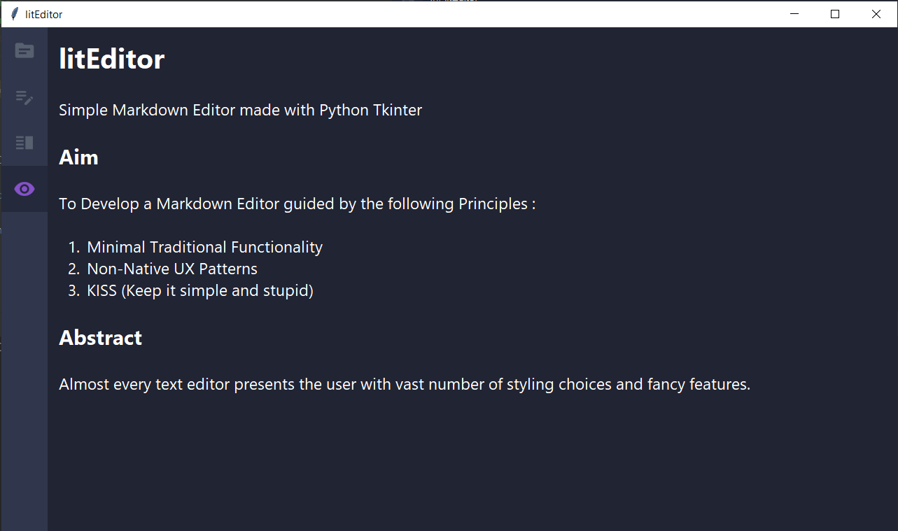
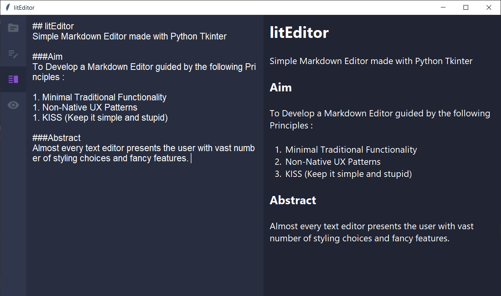

# litEditor

Simple Markdown Editor made with Python Tkinter

> _Submitted by_ GopiKrishnan (```CS19B1020```), Aman Mark Kunjur (```CS19B1005```), J Pushpavel (```CS19B1042```) and M Surendar (```CS19B1056```)

### Aim

To Develop a Markdown Editor guided by the following Principles :

1. Minimal Traditional Functionality
1. Non-Native UX Patterns
1. KISS (Keep it simple and stupid)

### Abstract

Almost every text editor presents the user with vast number of styling choices and fancy features. It lets user to lose
balance between productivity and decent styling. Markdown language mitigates the problem of decent styling, but most of
the markdown editors are feature rich or heavy and distracts the user. This project is motivated to address this issue
by providing a markdown editor with minimal functionality and non-distracting environment. it implements auto save
functionality, so the user focuses only on creating content. The user is presented with recently edited files making it
quicker to switch between files. it also avoids native menu bar in favour of tabs so that the user is presented with
minimum number of options.

### Markdown Language

#### What is Markdown?

Markdown is a way to style text on the web. You control the display of the document; formatting words as bold or italic,
adding images, and creating lists are just a few of the things we can do with Markdown.Mostly, Markdown is just regular
text with a few non-alphabetic characters thrown in, like ```#``` or ```*```.

#### Why Markdown?

- __Easy On The Eyes:__
  The overriding design goal for Markdown’s formatting syntax is to make it as readable as possible.

- __Fewer Errors:__
  Markdown’s simplicity and flexibility helps you make fewer mistakes, and errors are much easier to find.

- __Kill Your CMS(Content management system):__
  Markdown can be written anywhere there’s a blinking cursor and shared in any format. It’s just plain text. You don’t
  need any WYSIWYG controls, because the Markdown characters actually look like the formatted results you’ll get.

### UI Spec

1. Tab Layout

    <table>
        <tbody>
            <tr>
                <td>📁</td>
                <td rowspan="5">Selected Tab's Page</td>
            </tr>
            <tr><td>✍</td></tr>
            <tr><td>🔥</td></tr>
            <tr><td>👀</td></tr>
            <tr><td height="50"></td></tr>
        </tbody>
    </table>

    1. 📁 - Select Folder
    1. ✍ - Edit Markdown
    1. 🔥 - Edit Markdown and Markdown Preview side by side
    1. 👀 - Markdown Preview

### Basic Features

1. Cut, Copy, Paste between```clipboard``` and the ```Editable Text Area```
1. Undo, Redo
1. Keyboard shortcuts for the above two
1. Preview Markdown

### Additional Features

1. Auto save
2. Recent Files
3. Edit and Preview side by side
4. Default dark theme

### Typical User Flow

1. on opening litEditor, the user is presented with a Window with tabs (📁, ✍, 🔥, 👀)
2. ✍,🔥 & 👀 will be disabled
3. 📁 will be selected
4. after user selects a file in 📁.The disabled tabs(✍,🔥 & 👀) will become active
5. user edits the markdown in either ✍ or in one of the sides of 🔥
6. the edit is reflected in the preview(🔥 or 👀) live
7. changes are saved as the user is editing
8. if the user were to switch to 📁, then continue from step 4.

### State Management

#### Why ?

Changes in state and effects of those changes are separated into different places for maintainability, and these are
stream of changes.
(ex - editing text in ```✍ or 🔥 - Markdown Editor``` must be reflected in ```🔥, 👀 - Markdown View```
and ```auto saving system```). We need a mechanism to effectively communicate and handle these changes.

#### How ?

We are going to follow the ```Observer Pattern ⚡```. Tkinter provides ```StringVar``` that can be used to implement this
pattern.

### Architecture Overview

#### Initializing

- ```main.py``` is the entry point of the application
- ```lit_editor``` function declares the initial state of the application
- ```lit_editor``` instantiates ```StringVar```'s
    - ```logic``` functions are called which reacts to the changes of the ```StringVar```'s
    - ```other UIs``` are built passing their required ```StringVar```'s
    - ```other UIs``` are placed according to layout

#### Working

- the ```StringVar```'s passed from ```lit_editor``` help in communication
- ```UI``` updates those observables
- ```UI``` & ```Logic``` observes those updates and acts accordingly

### 3rd Party Libraries

#### Markdown to Html (```markdown2```)

- A fast and complete Python implementation of Markdown.
- we use it to convert Markdown texts into HTML string.

#### HTML Support (```tkhtmlview```)

- This module is a collection of tkinter widgets whose text can be set in HTML format. A HTML widget isn't a web browser
  frame, it's only a simple and lightweight HTML parser that formats the tags used by the tkinter Text base class.
- we use this module to display the html generated by ```markdown2```

#### Icon Support (```pillow```)

- The Python Imaging Library adds image processing capabilities to your Python interpreter.
- This library provides extensive file format support, an efficient internal representation, and fairly powerful image
  processing capabilities.
- The core image library is designed for fast access to data stored in a few basic pixel formats. It should provide a
  solid foundation for a general image processing tool.
- we use this module for displaying icon

### Screenshots of the Application

> First Experience



> Returning User Experience



> Editing Markdown



> Previewing Markdown



> Editing and Previewing side by side



### How to run ?

#### Prerequisites

- ```>= python 3.7```
- dependencies in ```requirements.txt``` file
- ```git```

#### Steps

- ```git clone https://github.com/Pushpavel/litEditor.git```
- install required dependencies
- ```python main.py```